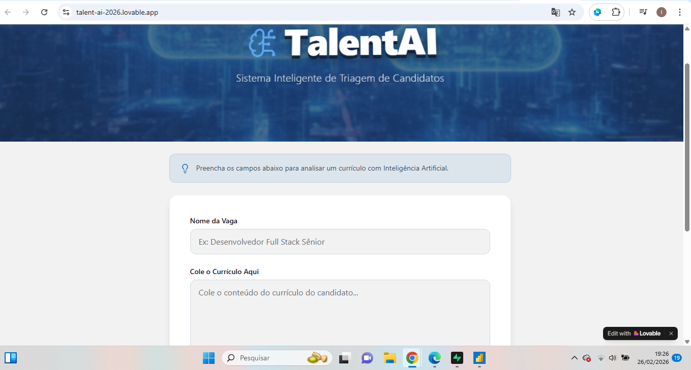
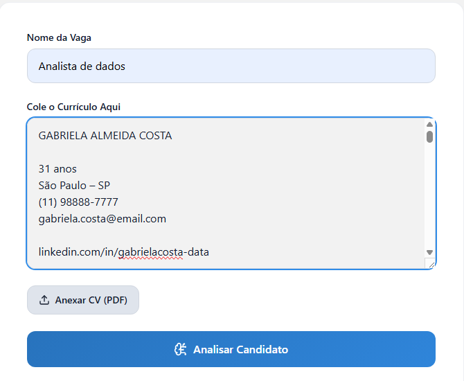
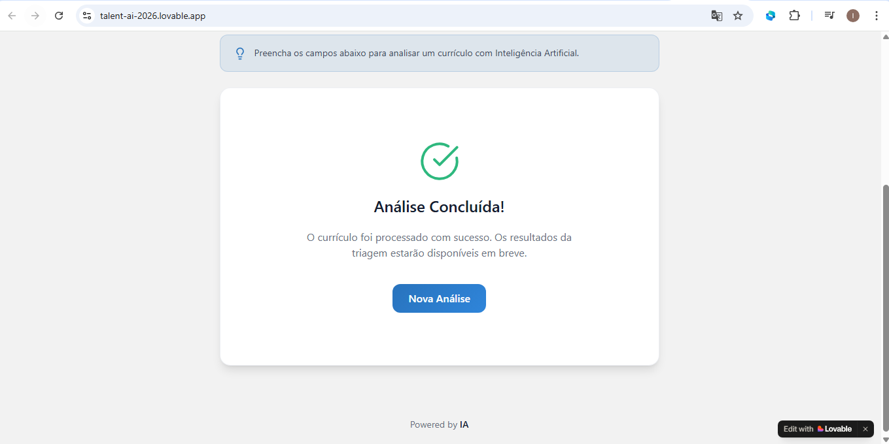
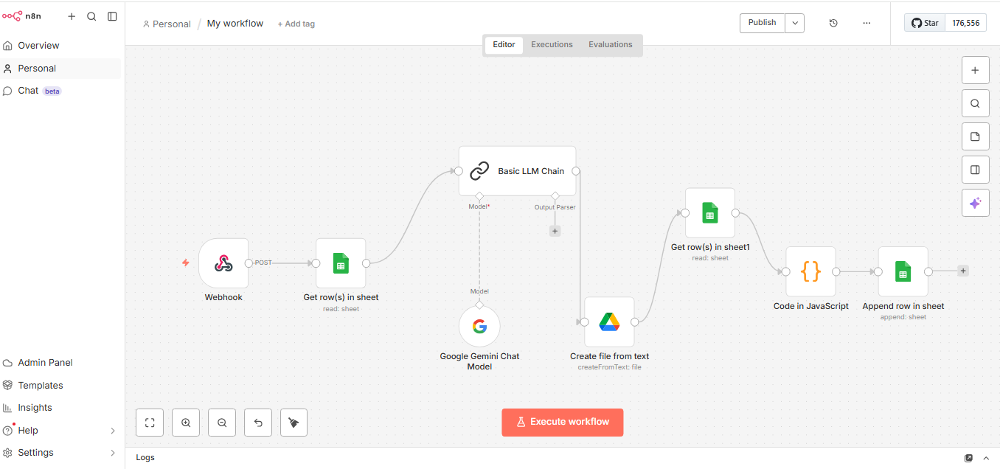
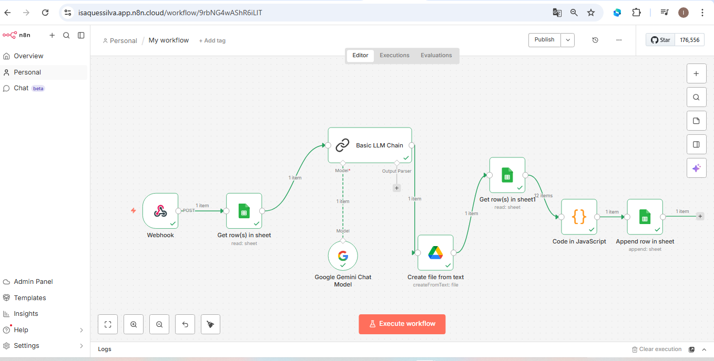
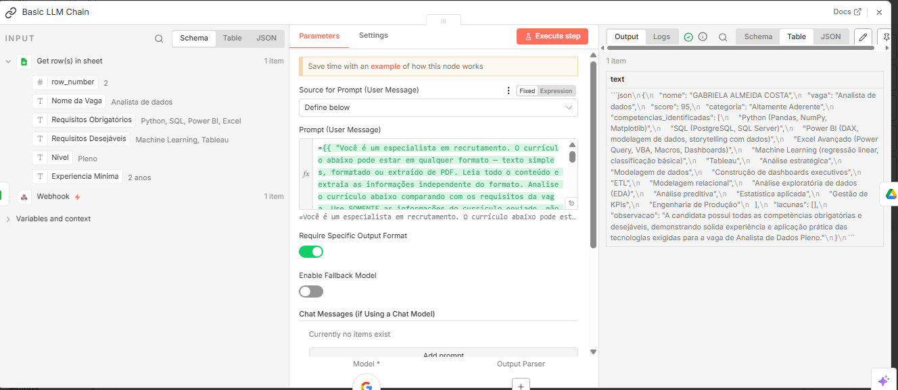
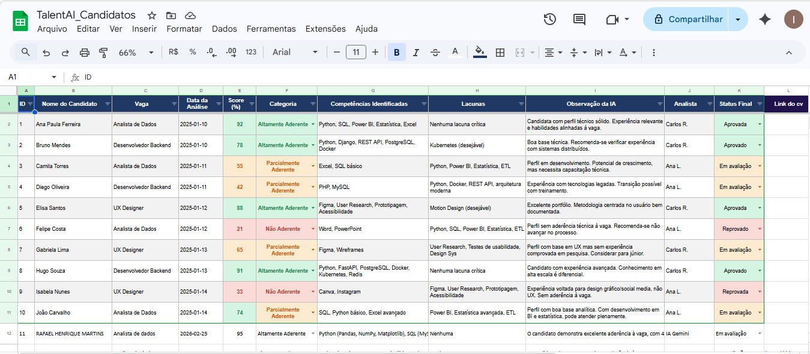
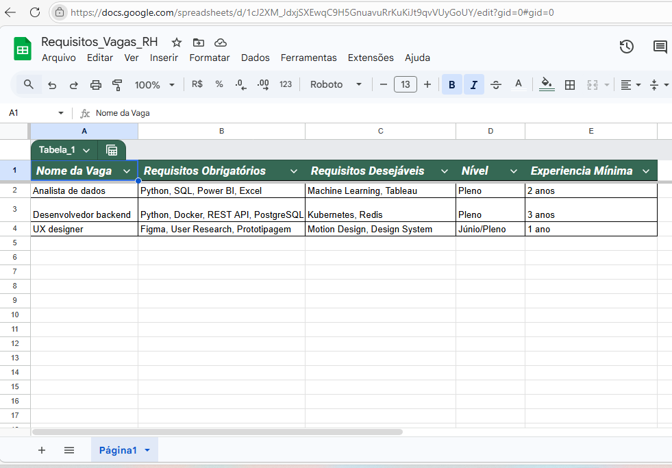
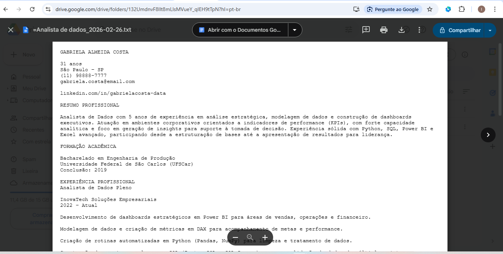
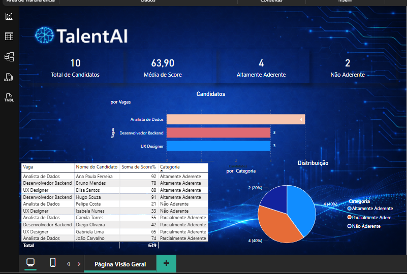

# 🧠 TalentAI — Sistema Inteligente de Triagem de Candidatos

> Automação completa de recrutamento com Inteligência Artificial, integrada a dashboards analíticos para apoio à decisão no RH.

---

## 📌 Sobre o Projeto

O **TalentAI** é um sistema end-to-end de triagem de currículos que utiliza IA generativa para analisar candidatos, gerar scores de compatibilidade e alimentar dashboards em tempo real — sem intervenção humana.

### O problema que resolve

| Antes | Depois |
|---|---|
| ❌ Triagem manual e demorada | ✅ Análise automática em segundos |
| ❌ Critérios subjetivos | ✅ Score padronizado por IA |
| ❌ Sem rastreabilidade | ✅ Histórico completo na planilha |
| ❌ Dashboards desatualizados | ✅ Indicadores em tempo real |

---

## 🏗️ Arquitetura do Sistema

```
Recrutador acessa a página (Lovable)
        ↓
Preenche nome da vaga + currículo
        ↓
Webhook recebe os dados (n8n)
        ↓
Busca requisitos da vaga (Google Sheets — aba Vagas)
        ↓
IA analisa e gera score (Google Gemini 2.5)
        ↓
CV arquivado como .txt (Google Drive — pasta TalentAI_CVs)
        ↓
Resultado salvo com link do CV (Google Sheets — aba Candidatos)
        ↓
Dashboard atualizado automaticamente (Power BI)
```

---

## 🛠️ Tecnologias Utilizadas

| Tecnologia | Função |
|---|---|
| **Lovable** | Interface web profissional para envio de currículos |
| **n8n Cloud** | Orquestração de toda a automação |
| **Google Gemini 2.5** | Análise de currículos e geração de score com IA |
| **Google Sheets** | Base de dados de candidatos e requisitos de vagas |
| **Google Drive** | Arquivo dos currículos originais em .txt |
| **Power BI** | Dashboards analíticos para o time de RH |

---

## ⚙️ Como Funciona

### 1. 🖥️ Interface de Envio (Lovable)
O recrutador acessa a página do TalentAI, informa o nome da vaga e cola o currículo do candidato. A página envia os dados automaticamente via webhook para o n8n.

### 2. ⚙️ Automação (n8n)
O n8n orquestra todo o fluxo em sequência — recebe os dados pelo webhook, busca os requisitos da vaga, envia para análise da IA, arquiva o CV no Google Drive e salva o resultado na planilha.

### 3. 🤖 Análise com IA (Google Gemini 2.5)
O Gemini recebe o currículo completo junto com os requisitos obrigatórios e desejáveis da vaga e retorna uma análise estruturada com score, competências identificadas, lacunas e observação para o recrutador.

### 4. 🎯 Classificação de Candidatos

| Categoria | Score | Significado |
|---|---|---|
| 🟢 Altamente Aderente | ≥ 70 | Atende os principais requisitos |
| 🟡 Parcialmente Aderente | 40 a 69 | Atende parte dos requisitos |
| 🔴 Não Aderente | < 40 | Não atende os requisitos mínimos |

---

## 🖼️ Prints do Projeto

### 1. Interface — Página TalentAI (Lovable)







---

### 2. Automação — Fluxo n8n







---

### 3. Base de Dados — Google Sheets





---

### 4. Arquivo de CVs — Google Drive



---

### 5. Dashboard — Power BI



---

## 🎯 Resultados

- ⚡ Análise completa de currículo em menos de 10 segundos
- 📋 Score e classificação gerados automaticamente pela IA
- 🗄️ CV arquivado no Google Drive com link direto na planilha
- 📈 Dashboard atualizado a cada novo candidato analisado
- 🔗 Fluxo 100% automatizado sem intervenção humana

---

## 👨‍💻 Sobre o Autor

Projeto desenvolvido para demonstrar habilidades práticas em:

- Automação de processos com **n8n**
- Integração de **IA generativa** em fluxos reais
- Análise e visualização de dados com **Power BI**
- Desenvolvimento de interfaces com **Lovable**
- Integração entre múltiplas plataformas e APIs

---

> 💡 *Este projeto foi desenvolvido com fins educacionais e de portfólio.*
> *Detalhes técnicos de implementação disponíveis mediante contato.*
